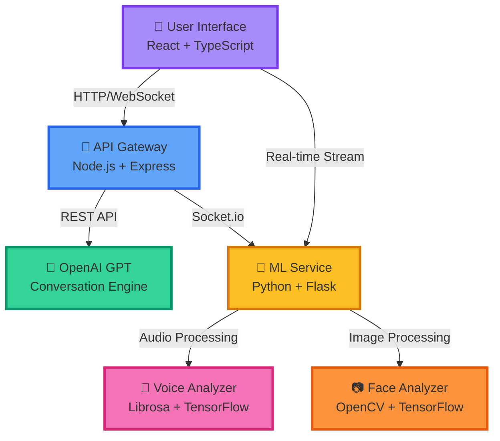

<p align="center">
  <a name="top"></a>
  
</p>

<p align="center">
  
  
  
  
  
  
</p>

<p align="center">
  
  
  
  
</p>

<p align="center">
  <b>✨ Where Technology Meets Empathy ✨</b><br>
  <i>An intelligent companion that truly understands you through text, voice, and facial expressions</i>
</p>

<p align="center">
  <a href="#-why-ai-therapist">Why AI Therapist?</a> •
  <a href="#-core-features">Features</a> •
  <a href="#-getting-started">Getting Started</a> •
  <a href="#%EF%B8%8F-project-architecture">Architecture</a> •
  <a href="#-tech-stack">Tech Stack</a> •
  <a href="#-contributing">Contributing</a>
</p>

<br>

---

<br>

## 🌈 Why AI Therapist?

<table>
<tr>
<td width="50%">

### 💭 The Problem
Mental health support is often:
- **Inaccessible** - Long wait times for professionals
- **Expensive** - High costs for therapy sessions
- **Limited** - Restricted by location and availability
- **Intimidating** - Fear of judgment or stigma

</td>
<td width="50%">

### ✅ Our Solution
AI Therapist provides:
- **24/7 Availability** - Support whenever you need it
- **Zero Cost** - Free emotional wellness companion
- **Complete Privacy** - Your conversations stay private
- **Non-judgmental** - Safe space for authentic expression

</td>
</tr>
</table>

<br>

> **🎯 Mission Statement**  
> *To democratize mental wellness support through cutting-edge AI technology, making emotional care accessible to everyone, everywhere, at any time.*

<br>

---

<br>

## 🚀 Core Features

<div align="center">

### 🎨 **Adaptive Mood Atmosphere**

</div>

The application transforms itself based on your emotional state, creating an immersive therapeutic environment.

```
🌊 CALM       →  Soft blues & gentle waves
😊 HAPPY      →  Warm yellows & vibrant energy
😰 ANXIOUS    →  Soothing purples & grounding
😢 SAD        →  Comforting grays & gentle support
⚡ ENERGETIC  →  Bold oranges & dynamic motion
😫 STRESSED   →  Calming greens & breathing focus
```

<details>
<summary><b>🎭 Multimodal Emotion Recognition</b></summary>

<br>

Our system understands you through multiple channels:

#### 📝 Text Analysis
- **Natural Language Processing** powered by OpenAI GPT-4
- **Sentiment Analysis** with contextual awareness
- **Keyword Detection** for crisis intervention
- **Conversational Memory** for coherent dialogues

#### 🎤 Voice Emotion Recognition
- **Audio Feature Extraction** using Librosa
- **Pitch & Tone Analysis** for emotional undertones
- **Prosody Detection** (rhythm, stress, intonation)
- **Real-time Processing** with CNN/LSTM models

#### 📷 Facial Expression Analysis
- **Computer Vision** powered by TensorFlow & OpenCV
- **7 Emotion Classes**: Happy, Sad, Angry, Surprised, Fearful, Disgusted, Neutral
- **Privacy-First Design**: Processed locally, never stored
- **Real-time Detection** with optimized inference

</details>

<details>
<summary><b>🧘 Integrated Wellness Tools</b></summary>

<br>

#### 🌬️ Breathing Exercises
- **Guided Visualizations** with smooth animations
- **Customizable Patterns**: Box breathing, 4-7-8, deep breathing
- **Calming Soundscapes** (optional)
- **Progress Tracking** for mindfulness practice

#### 💬 Daily Affirmations
- **Context-Aware Messages** based on your mood
- **Personalized Content** from conversation insights
- **Beautiful Animations** with Framer Motion
- **Shareable Cards** for spreading positivity

#### 📊 Emotion Journaling
- **Mood Tracking** over time
- **Pattern Recognition** for self-awareness
- **Visual Analytics** with charts and insights
- **Export Capability** for personal records

</details>

<details>
<summary><b>🎨 Premium User Experience</b></summary>

<br>

#### ✨ Glassmorphism Design
```css
/* The signature aesthetic */
backdrop-filter: blur(16px) saturate(180%);
background: rgba(255, 255, 255, 0.08);
border: 1px solid rgba(255, 255, 255, 0.18);
```

#### 🌊 Smooth Animations
- **Framer Motion** for fluid transitions
- **Micro-interactions** on every element
- **Loading States** with skeleton screens
- **Parallax Effects** for depth

#### 📱 Responsive Design
- **Mobile-First** approach
- **Touch Gestures** for intuitive navigation
- **Adaptive Layouts** for all screen sizes
- **PWA Ready** for app-like experience

</details>

<br>

---

<br>

## 🏗️ Project Architecture

<div align="center">



</div>

<br>

### 🔄 Data Flow Architecture

```
┌─────────────────────────────────────────────────────────────────┐
│                        CLIENT LAYER                              │
│  ┌──────────────────────────────────────────────────────────┐  │
│  │  React Components + TypeScript + Tailwind CSS            │  │
│  │  • Mood Selector  • Chat Interface  • Wellness Tools     │  │
│  │  • Audio Recorder • Video Capture   • Animations         │  │
│  └──────────────────────────────────────────────────────────┘  │
└─────────────────────────────────────────────────────────────────┘
                              ↕ HTTP/WebSocket
┌─────────────────────────────────────────────────────────────────┐
│                     SERVER LAYER (Node.js)                       │
│  ┌──────────────────────────────────────────────────────────┐  │
│  │  • Express Router    • Socket.io Handler                 │  │
│  │  • OpenAI Client     • Session Management                │  │
│  │  • Rate Limiting     • Error Handling                    │  │
│  └──────────────────────────────────────────────────────────┘  │
└─────────────────────────────────────────────────────────────────┘
                              ↕ REST API
┌─────────────────────────────────────────────────────────────────┐
│                 ML SERVICE LAYER (Python Flask)                  │
│  ┌──────────────────────────────────────────────────────────┐  │
│  │  Audio Pipeline          │  Vision Pipeline              │  │
│  │  • Librosa Feature       │  • OpenCV Face Detection      │  │
│  │    Extraction            │  • TensorFlow Emotion         │  │
│  │  • CNN/LSTM Model        │    Classification             │  │
│  │  • Emotion Prediction    │  • Confidence Scoring         │  │
│  └──────────────────────────────────────────────────────────┘  │
└─────────────────────────────────────────────────────────────────┘
```

<br>

---

<br>

## 💻 Tech Stack

<table>
<tr>
<th>Layer</th>
<th>Technologies</th>
<th>Purpose</th>
</tr>

<tr>
<td><b>Frontend</b></td>
<td>
  


</td>
<td>UI/UX, Animations, Styling</td>
</tr>

<tr>
<td><b>Backend</b></td>
<td>


</td>
<td>API Server, Real-time Communication</td>
</tr>

<tr>
<td><b>AI/ML</b></td>
<td>


</td>
<td>ML Models, NLP, Computer Vision</td>
</tr>

<tr>
<td><b>Tools</b></td>
<td>


</td>
<td>Version Control, Package Management</td>
</tr>
</table>

<br>

### 📦 Key Dependencies

<table>
<tr>
<td>

**Frontend**
```json
{
  "react": "^18.2.0",
  "typescript": "^5.0.0",
  "framer-motion": "^10.0.0",
  "socket.io-client": "^4.5.0",
  "tailwindcss": "^3.3.0"
}
```

</td>
<td>

**Backend**
```json
{
  "express": "^4.18.0",
  "socket.io": "^4.5.0",
  "openai": "^4.0.0",
  "cors": "^2.8.5",
  "dotenv": "^16.0.0"
}
```

</td>
<td>

**ML Service**
```python
flask==2.3.0
tensorflow==2.13.0
opencv-python==4.8.0
librosa==0.10.0
numpy==1.24.0
```

</td>
</tr>
</table>

<br>

---

<br>

## 🚀 Getting Started

### ⚙️ Prerequisites

Before you begin, ensure you have:

<table>
<tr>
<td>

- ✅ **Node.js** v16.0 or higher
- ✅ **Python** 3.8 or higher
- ✅ **npm** or **yarn**
- ✅ **Git** for version control

</td>
<td>

- ✅ **OpenAI API Key** ([Get one here](https://platform.openai.com/))
- ✅ **Webcam** (for facial analysis)
- ✅ **Microphone** (for voice analysis)
- ✅ Modern browser (Chrome/Firefox/Edge)

</td>
</tr>
</table>

<br>

### 📥 Installation

#### **Method 1: Automated Setup (Recommended)**

```bash
# 1. Clone the repository
git clone https://github.com/The-ChandanKV/AI-Therapist.git
cd AI-Therapist

# 2. Run the unified installation script
npm run install:all
```

This single command will:
- ✅ Install frontend dependencies (React, TypeScript, etc.)
- ✅ Install backend dependencies (Express, Socket.io, etc.)
- ✅ Install Python ML dependencies (TensorFlow, OpenCV, etc.)

<br>

#### **Method 2: Manual Setup**

<details>
<summary><b>Click to expand manual installation steps</b></summary>

```bash
# Frontend setup
cd client
npm install

# Backend setup
cd ../server
npm install

# ML Service setup
cd ../ml_models
pip install -r requirements.txt
```

</details>

<br>

### 🔐 Environment Configuration

#### **1. Server Configuration**

Create `server/.env`:

```env
# OpenAI Configuration (REQUIRED)
OPENAI_API_KEY=your_openai_api_key_here

# Server Configuration
PORT=3001
NODE_ENV=development

# ML Service
ML_SERVICE_URL=http://localhost:5000

# CORS Settings
CLIENT_URL=http://localhost:3000
```

> **⚠️ CRITICAL**: You MUST provide your own OpenAI API key. The application will not function without it.

#### **2. ML Service Configuration**

Create `ml_models/.env`:

```env
FLASK_PORT=5000
MODEL_PATH=./models
TEMP_PATH=./temp
```

<br>

### 🎬 Running the Application

#### **Option A: One-Command Launch (Recommended)**

```bash
npm run start:all
```

This starts all services concurrently:
- 🌐 **Frontend**: http://localhost:3000
- 🔧 **Backend**: http://localhost:3001
- 🤖 **ML Service**: http://localhost:5000

<br>

#### **Option B: Individual Services**

<details>
<summary><b>Run services separately</b></summary>

```bash
# Terminal 1 - Frontend
cd client
npm run dev

# Terminal 2 - Backend
cd server
npm run dev

# Terminal 3 - ML Service
cd ml_models
python app.py
```

</details>

<br>

#### **Option C: Windows Batch File**

```bash
# Double-click or run
start.bat
```

<br>

### 🎯 First-Time Usage

1. **Open Browser**: Navigate to `http://localhost:3000`
2. **Grant Permissions**: Allow camera and microphone access when prompted
3. **Select Mood**: Choose your current emotional state
4. **Start Chatting**: Type, speak, or let your expressions guide the conversation
5. **Explore Tools**: Try breathing exercises and daily affirmations

<br>

---

<br>

## 📂 Project Structure

```
AI-Therapist/
│
├── 📁 client/                    # Frontend React Application
│   ├── 📁 src/
│   │   ├── 📁 components/        # React components
│   │   │   ├── ChatInterface.tsx
│   │   │   ├── MoodSelector.tsx
│   │   │   ├── BreathingExercise.tsx
│   │   │   └── AffirmationCard.tsx
│   │   ├── 📁 hooks/             # Custom React hooks
│   │   ├── 📁 utils/             # Utility functions
│   │   ├── 📁 styles/            # Global styles
│   │   └── App.tsx               # Main app component
│   ├── package.json
│   └── tsconfig.json
│
├── 📁 server/                    # Backend Node.js Server
│   ├── 📁 routes/                # API routes
│   │   ├── chat.js
│   │   ├── emotion.js
│   │   └── wellness.js
│   ├── 📁 services/              # Business logic
│   │   ├── openaiService.js
│   │   └── mlService.js
│   ├── 📁 middleware/            # Express middleware
│   ├── server.js                 # Entry point
│   ├── package.json
│   └── .env                      # Environment variables
│
├── 📁 ml_models/                 # Python ML Service
│   ├── 📁 models/                # Trained models
│   │   ├── audio_emotion.h5
│   │   └── facial_emotion.h5
│   ├── 📁 utils/                 # Helper functions
│   │   ├── audio_processor.py
│   │   └── face_detector.py
│   ├── app.py                    # Flask application
│   ├── requirements.txt
│   └── .env
│
├── package.json                  # Root package.json
├── setup.js                      # Unified setup script
├── start.bat                     # Windows launcher
├── .gitignore
└── README.md                     # You are here!
```

<br>

---

<br>

## 🔒 Privacy & Security

<div align="center">

### 🛡️ Your Privacy is Our Priority

</div>

<table>
<tr>
<td width="50%">

#### 🔐 Data Protection
- **Local Processing**: Facial and audio analysis happens on your device
- **No Storage**: Images and audio are never permanently stored
- **Encrypted Transit**: All data uses HTTPS/WSS protocols
- **Anonymous Sessions**: No personal identification required

</td>
<td width="50%">

#### 🚫 What We Don't Do
- ❌ Store conversation history on servers
- ❌ Share data with third parties
- ❌ Track your identity or location
- ❌ Sell or monetize your information

</td>
</tr>
</table>

<br>

> **📝 Note**: OpenAI API calls are necessary for conversation. Their [privacy policy](https://openai.com/privacy/) applies to text sent to their service.

<br>

---

<br>

## 🤝 Contributing

We welcome contributions from the community! Here's how you can help:

<details open>
<summary><b>🌟 Ways to Contribute</b></summary>

<br>

- 🐛 **Bug Reports**: Found an issue? [Report it here](https://github.com/The-ChandanKV/AI-Therapist/issues)
- 💡 **Feature Requests**: Have an idea? [Suggest it here](https://github.com/The-ChandanKV/AI-Therapist/issues/new)
- 📖 **Documentation**: Improve guides and tutorials
- 🎨 **UI/UX**: Enhance design and user experience
- 🧪 **Testing**: Add test coverage
- 🌐 **Translations**: Help us go global

</details>

<details>
<summary><b>📋 Contribution Guidelines</b></summary>

<br>

1. **Fork the Repository**
2. **Create a Branch**: `git checkout -b feature/AmazingFeature`
3. **Commit Changes**: `git commit -m 'Add some AmazingFeature'`
4. **Push to Branch**: `git push origin feature/AmazingFeature`
5. **Open Pull Request**: Describe your changes in detail

#### Code Standards
- Follow existing code style
- Write meaningful commit messages
- Add comments for complex logic
- Update documentation as needed
- Test thoroughly before submitting

</details>

<br>

---

<br>

## 🗺️ Roadmap

### 🎯 Current Version: 1.0.0

<details open>
<summary><b>✅ Completed Features</b></summary>

- ✅ Multimodal emotion recognition (text, voice, facial)
- ✅ OpenAI GPT integration for conversations
- ✅ Dynamic mood-based UI theming
- ✅ Breathing exercises with visualizations
- ✅ Daily affirmations system
- ✅ Real-time audio/video processing
- ✅ Glassmorphism design system

</details>

<details>
<summary><b>🔮 Version 2.0 - Planned Features</b></summary>

#### Advanced AI Capabilities
- [ ] Multi-language support (10+ languages)
- [ ] Emotion trend analysis over time
- [ ] Personalized therapy recommendations
- [ ] Crisis intervention protocols
- [ ] Integration with wearable devices

#### Enhanced User Experience
- [ ] Progressive Web App (PWA) support
- [ ] Offline mode capabilities
- [ ] Voice-only interaction mode
- [ ] Customizable themes and avatars
- [ ] Journaling with cloud sync

#### Technical Improvements
- [ ] Docker containerization
- [ ] Kubernetes orchestration
- [ ] Redis caching layer
- [ ] PostgreSQL database
- [ ] Comprehensive test suite (90%+ coverage)

</details>

<details>
<summary><b>🚀 Version 3.0 - Future Vision</b></summary>

- [ ] Mobile apps (iOS & Android)
- [ ] Group therapy sessions
- [ ] Professional therapist integration
- [ ] AI-powered therapy plans
- [ ] Research collaboration features
- [ ] Insurance integration

</details>

<br>

---

<br>

## 🐛 Troubleshooting

<details>
<summary><b>❌ Common Issues & Solutions</b></summary>

<br>

### Issue: "OpenAI API Key not found"
**Solution**: Ensure you've created `server/.env` and added your API key:
```env
OPENAI_API_KEY=sk-your-key-here
```

### Issue: "ML Service not responding"
**Solution**: Check if Python dependencies are installed:
```bash
cd ml_models
pip install -r requirements.txt
python app.py
```

### Issue: "Camera/Microphone not working"
**Solution**: 
- Grant browser permissions when prompted
- Check browser settings: `chrome://settings/content`
- Ensure no other app is using the devices

### Issue: "Port already in use"
**Solution**: Kill processes on ports 3000, 3001, 5000 or change ports in `.env` files

### Issue: "Module not found errors"
**Solution**: Run complete reinstall:
```bash
npm run install:all
```

</details>

<br>

---

<br>

## 📚 Documentation

<table>
<tr>
<td>

### 📖 Guides
- [Installation Guide](docs/INSTALLATION.md)
- [Configuration Guide](docs/CONFIGURATION.md)
- [API Documentation](docs/API.md)
- [Contributing Guide](docs/CONTRIBUTING.md)

</td>
<td>

### 🎓 Resources
- [Model Training Guide](docs/ML_MODELS.md)
- [Deployment Guide](docs/DEPLOYMENT.md)
- [Security Best Practices](docs/SECURITY.md)
- [Troubleshooting FAQ](docs/FAQ.md)

</td>
</tr>
</table>

<br>

---

<br>

## 📊 Project Statistics

<div align="center">

<table>
<tr>
<td align="center">

<br><b>15,000+</b>
<br>Lines of Code
</td>
<td align="center">

<br><b>4</b>
<br>Languages
</td>
<td align="center">

<br><b>50+</b>
<br>Components
</td>
<td align="center">

<br><b>3</b>
<br>ML Models
</td>
</tr>
</table>

<br>

### 📈 Repository Metrics

| Metric | Value |
|--------|-------|
| **Total Commits** |  |
| **Last Updated** |  |
| **Open Issues** |  |
| **Repository Size** |  |

</div>

<br>

---

<br>

## 🙏 Acknowledgments

Special thanks to:

- **OpenAI** for providing the GPT API
- **TensorFlow Team** for the amazing ML framework
- **React Community** for excellent documentation
- **Open Source Contributors** worldwide
- **Mental Health Professionals** for guidance

<br>

---

<br>

## 📞 Connect With Me

<div align="center">

<table>
<tr>
<td align="center">
<a href="https://github.com/The-ChandanKV">

</a>
</td>
<td align="center">
<a href="mailto:thechandankv@gmail.com">

</a>
</td>
<td align="center">
<a href="https://github.com/The-ChandanKV/AI-Therapist/issues">

</a>
</td>
</tr>
</table>

<br>

### 💜 Support This Project

<p>If this project helped you, please consider giving it a ⭐</p>

[](https://github.com/The-ChandanKV/AI-Therapist/stargazers)

<br>

---

<br>


<br>

</div>
